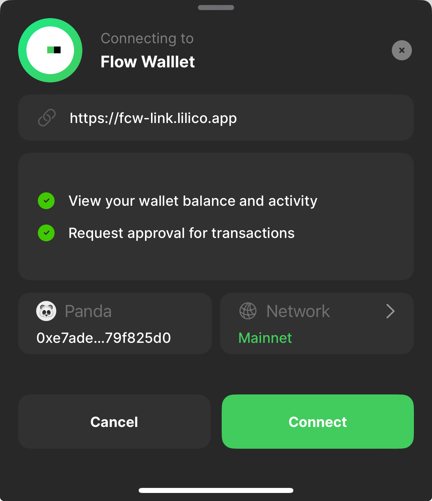

# 🖥️ Extension Wallet Restore Guide

Welcome to the Flow  extension Wallet Account Restoration Guide! This resource will help you seamlessly restore your account using various backup methods. Whether you need to recover your wallet from a device backup or access your account using raw keys, we've got you covered.

When you want to import a profile, simply navigate to the sidebar and click on **Import Profile**.

<figure><figcaption></figcaption></figure>

### From Device Backup

When you have already logged into an account on mobile device and want to import the same account on your extension, you can use the device backup feature. Here’s how:

**Step 1:** On your computer , select **‘Sync With Mobile App’**.

<figure><figcaption></figcaption></figure>

 

<figure><figcaption></figcaption></figure>

**Step 2:** On the phone, open the Flow Wallet app and use the scan feature located in the top right corner to scan the QR code.

<figure><figcaption></figcaption></figure>

**Step 3:**  Once you successfully scan the QR code, the computer screen will display the following message. On the phone, click'**Connect**' in  **Connect for Flow Wallet**.

<figure><figcaption></figcaption></figure>

 

<figure><figcaption></figcaption></figure>

**Step 4:** On the  phone, click '**Hold to Sync'.**

<figure><figcaption></figcaption></figure>

**Step 5:** On the  Computer, click '**Login'.** This will complete the device backup process, allowing you to access your account on your current device.

<figure><figcaption></figcaption></figure>

 

<figure><figcaption></figcaption></figure>

### From Raw Key

The Flow Wallet Mobile version allows users to import profile from the Flow Wallet extension as well as various external accounts. In the section below, we will explain how to use Google Drive, full access mnemonic phrases, keystore files, and private keys to import your profiles seamlessly.

<figure><figcaption></figcaption></figure>

#### Google Drive(if create Backup in web extension)

Restore a backup in Google drive by following the on-screen instructions.

<figure><figcaption></figcaption></figure>

#### 12 word Seed Phrase

Enter your 12-word seed phrase in the correct order.

If you have a specific derivation path or passphrase, make sure to enter it as needed.

Once you’ve entered your seed phrase (and passphrase if applicable), you should have access to your wallet and funds.

<figure><figcaption></figcaption></figure>

#### Keystore (for Blocto users)

Copy and past your Blocto keystore json data in the correct order.

Enter your password and ensure that the password is entered correctly (it is case-sensitive).

<figure><figcaption></figcaption></figure>

#### Private key

Copy and past your private key in the correct order.

<figure><figcaption></figcaption></figure>

### Support

If you encounter any issues or have further questions, please reach out to our support team at support@flow.com.
