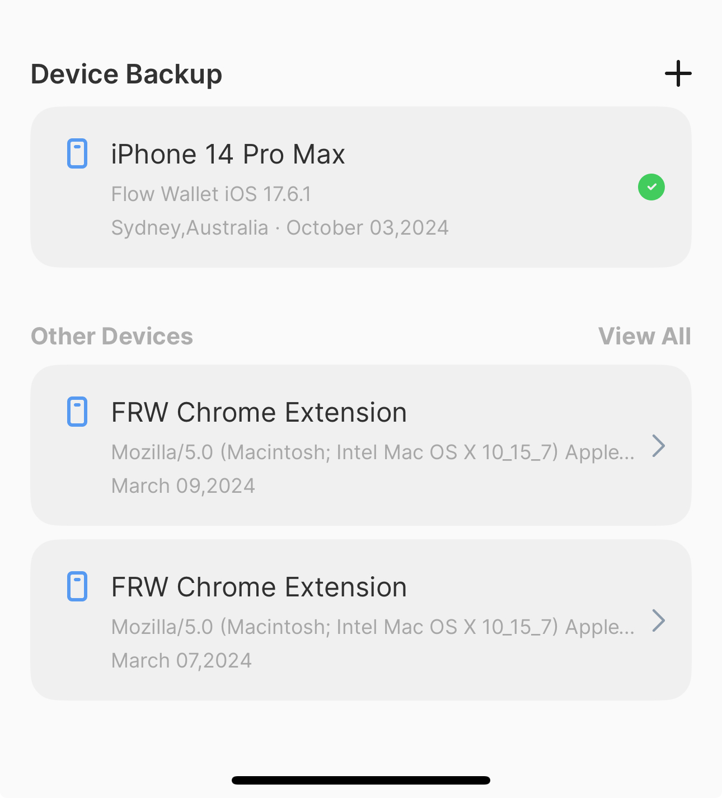
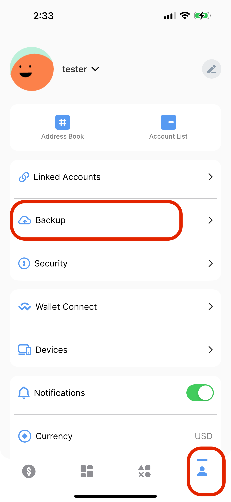
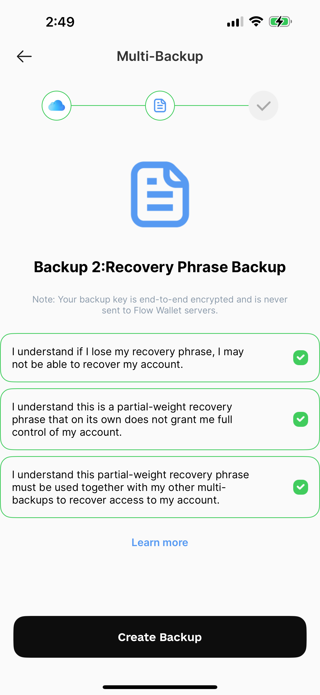
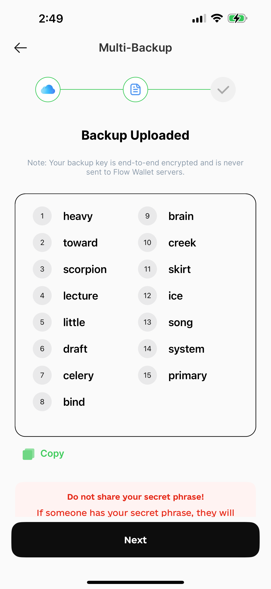
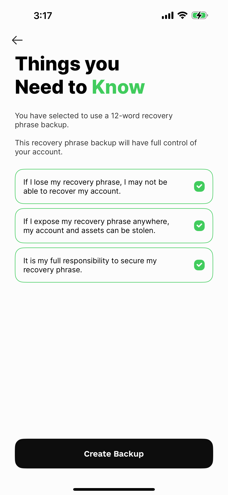
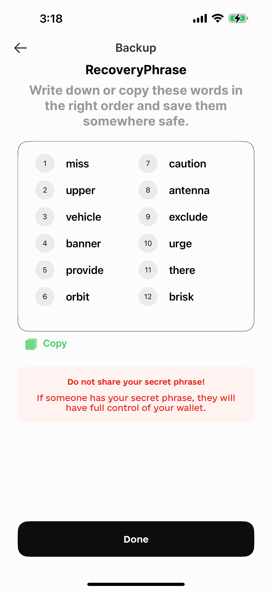

# 🔐 Mobile Wallet Backup Guide

Welcome to the Flow Mobile Wallet! Our wallet is designed to provide a secure and user-friendly experience for managing your digital assets. One of the standout features of the Flow Mobile Wallet is its robust backup options, ensuring that your funds remain safe and accessible.

#### Device Backup

Designed with your security in mind, our mobile wallet utilizes secure enclave technology to ensure that your account is created and managed safely. With this cutting-edge approach, no private keys are accessible by the wallet team, giving you complete control over your digital assets.

With the Flow Mobile Wallet, you can easily back up your entire wallet on your device. When you register or log into your profile on your device, your profile will be automatically backed up on your device. And you can scan the QR code shown by the Flow Wallet to sync your wallet between your device. \[Restore guideline link]

And you can view your device backup details in Backup section in Profile page.

<figure><figcaption></figcaption></figure>

#### Multi-Backup

For added flexibility, the Flow Mobile Wallet supports multi-backup options. Users can create multiple backups across different devices or cloud services, ensuring that you always have access to your wallet.&#x20;

A multi-backup stores multiple partial-weight keys across your accounts on trusted providers like Google Drive and iCloud(only in IOS), or a Recovery Phrase.

Two partial-weight keys must be used together to recover access to your account. Each key individually cannot be used. This means, that to recover access to your account, Flow Wallet requires access to two of your backups.

Your backups are encrypted using your wallet PIN code. You must remember or write down your PIN code and store it in a safe place.

**Step 1:** Navigate to the **Profile** page and select the **Backup** section.

<figure><figcaption></figcaption></figure>

**Step 2:** Choose 'Create Multi-Backup'.

**Step 3:** Select at least two types of backup options to ensure your assets are protected.

<figure><figcaption></figcaption></figure>

**Step 4:** If prompted, create a new PIN or verify your existing PIN to proceed with the backup process.

**Step 5:** Follow the prompts to initiate the backup process in Google Drive.

<figure><figcaption></figcaption></figure>

**Step 6:** Create a backup in iCloud by following the on-screen instructions.

**Step 7:** Carefully read all information regarding the recovery phrase backup. Once you understand the instructions, tick the checkbox to acknowledge.

<figure><figcaption></figcaption></figure>

**Step 8:** Copy your seed phrase and store it securely.

<figure><figcaption></figcaption></figure>

**Step 9:** Click the **Next** button. On the confirmation page, review your backups and ensure everything is in order.

#### Seed Phrase Backup

Creating a seed phrase is a traditional method for securing your digital assets. Unlike secure enclave methods, which rely on hardware-level security, a seed phrase provides a straightforward way to restore and access your wallet across devices. This guide will walk you through the process of creating a full access seed phrase in the Flow Wallet.

**Step 1:** Navigate to the **Profile** page and select the **Backup** section.

<figure><figcaption></figcaption></figure>

**Step 2:** Choose 'Create Recovery Phrase Backup'.

**Step 3:** Carefully read all information regarding the recovery phrase backup. Once you understand the instructions, tick the checkbox to acknowledge.

<figure><figcaption></figcaption></figure>

**Step 4:** Copy your seed phrase and store it securely.

<figure><figcaption></figcaption></figure>

**Step 5:** Click the **Next** button. On the confirmation page, review your seed phrase backup and ensure everything is in order.

### Support

If you encounter any issues or have further questions, please reach out to our support team at support@flow.com.

