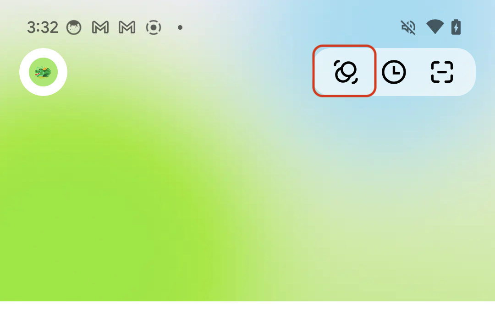
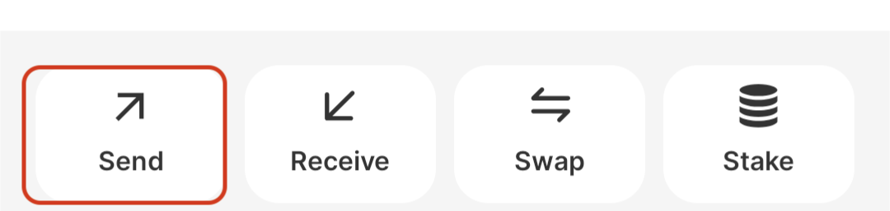
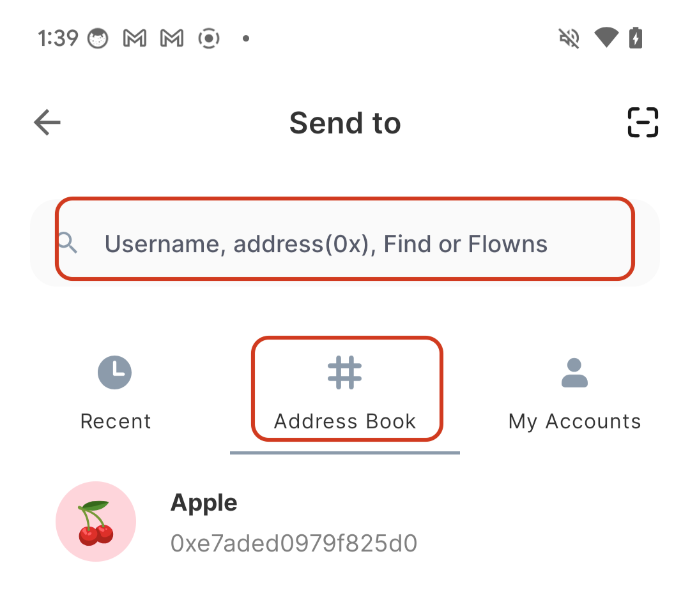
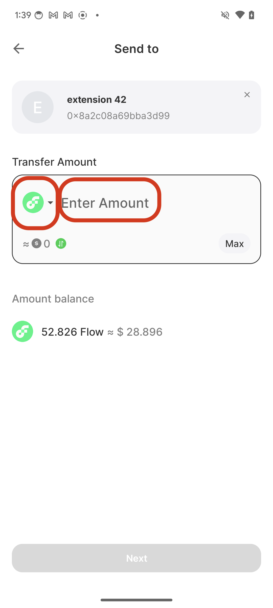
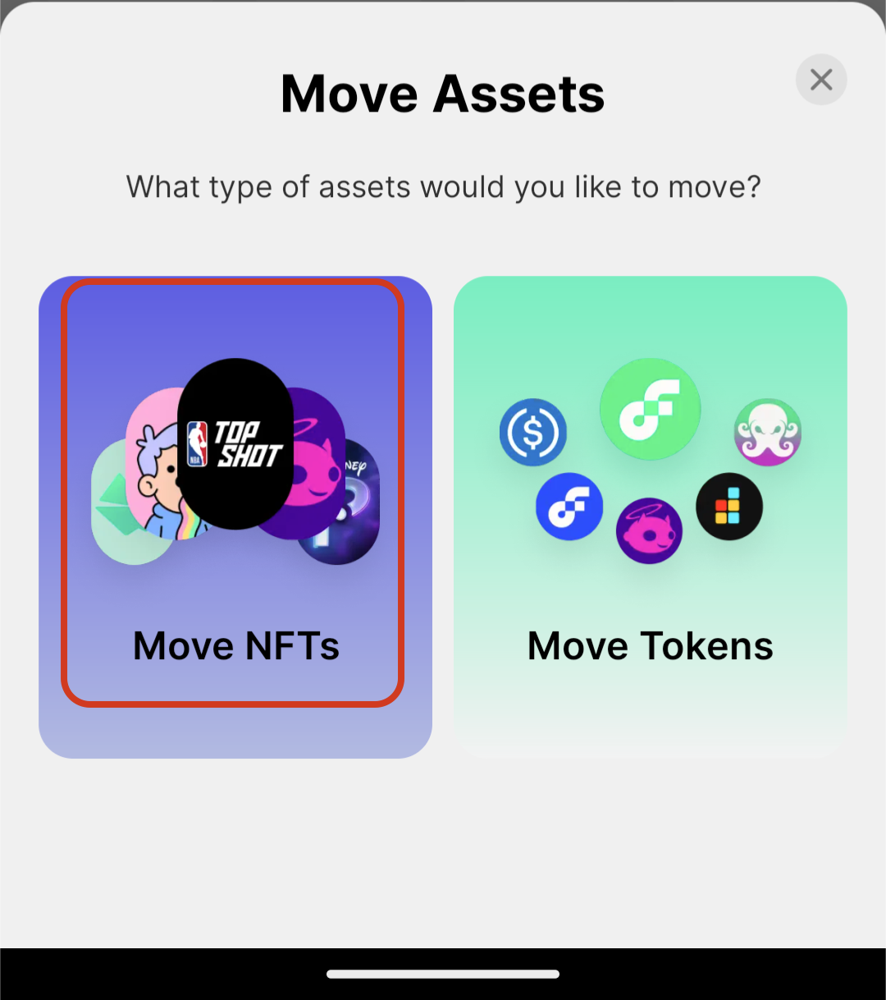
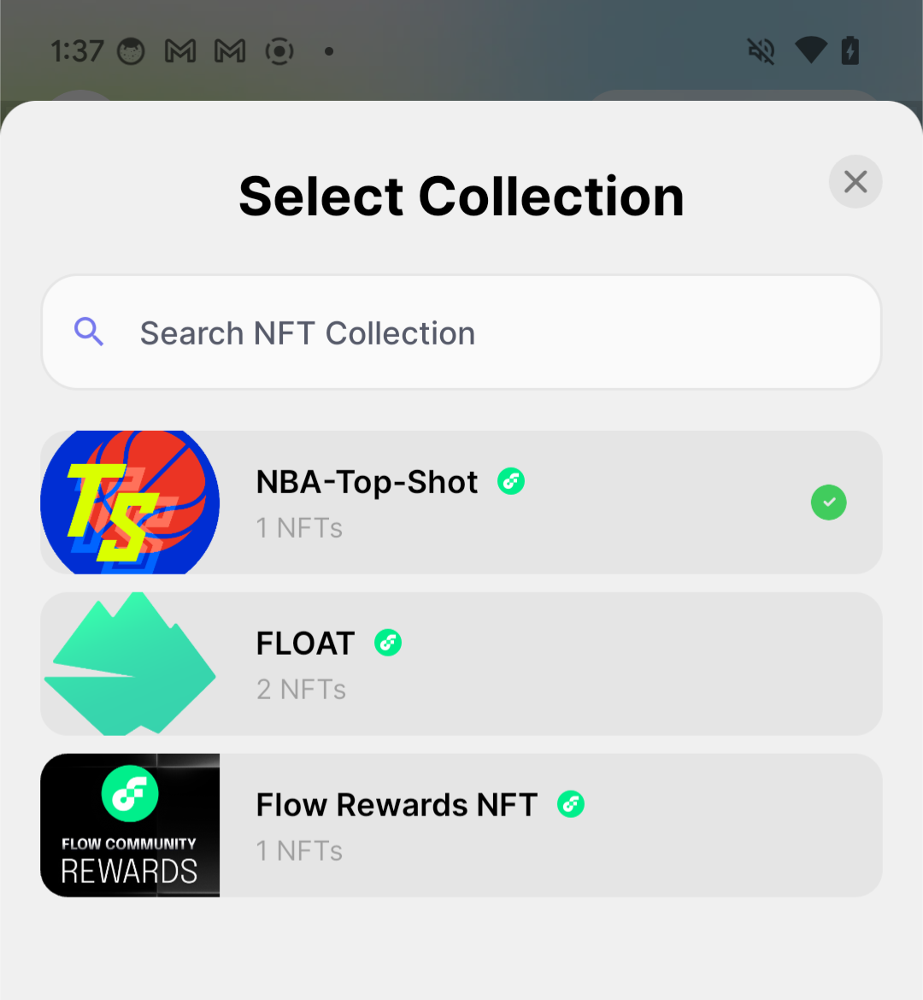
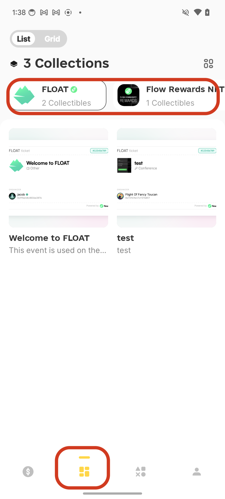
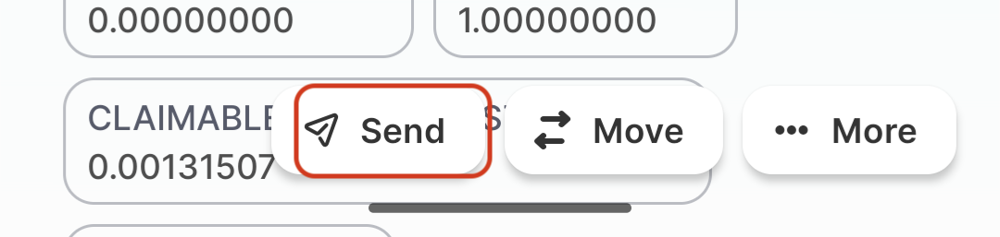
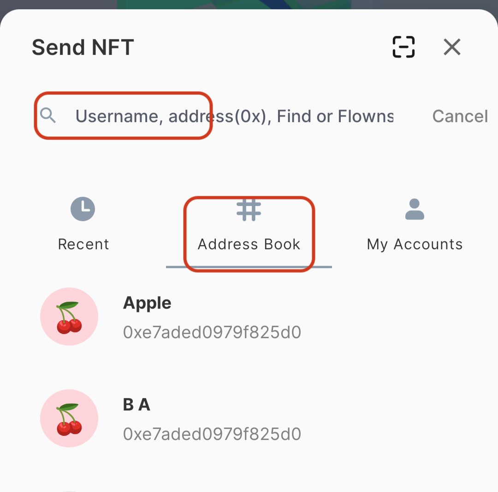
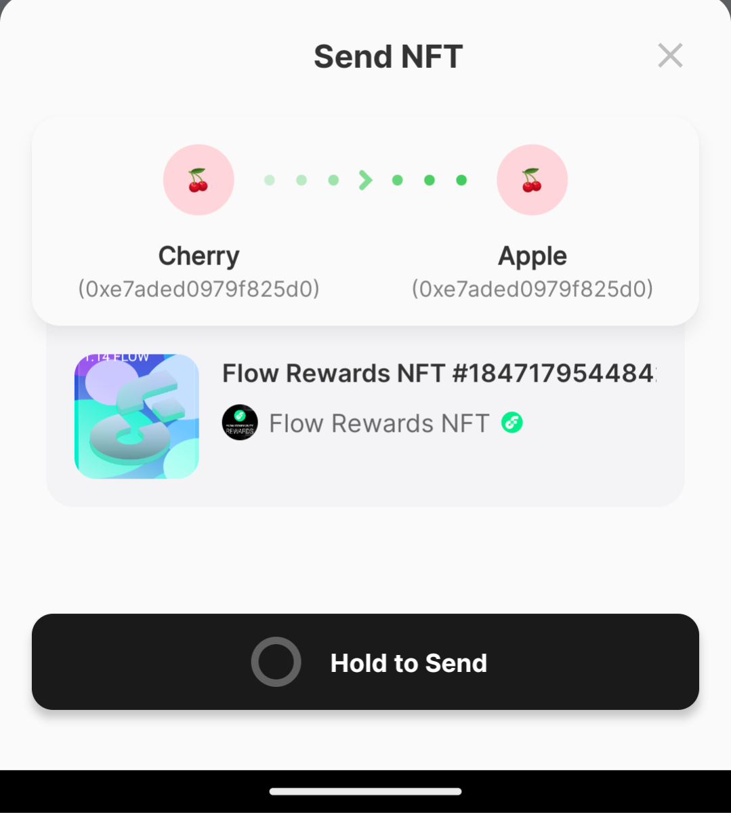

# 💸 Move Assets between Flow and EVM

### Indroduction

Welcome to our tutorial on transferring FT  and NFT between Flow Wallet, COA (Flow EVM), and EOA (Externally Owned Accounts ). As the blockchain ecosystem continues to expand, understanding how to navigate different wallets and protocols is essential for maximizing your digital asset management. This guide will provide step-by-step instructions on how to seamlessly transfer tokens between Flow Wallet and EVM environments, ensuring you can effectively manage both your fungible and non-fungible assets.&#x20;

There are three types of accounts used for EVM on Flow.

1. **Externally Owned Accounts (EOA)**: EOAs are controlled by private individuals using cryptographic keys and can initiate transactions directly. They are the primary account type for users to interact with the blockchain, holding and sending cryptocurrency or calling smart contract functions.
2. **Contract Accounts**: These accounts hold smart contract code and are governed by this code's logic. Unlike EOAs, Contract Accounts do not initiate transactions on their own but can execute transactions in response to calls they receive from EOAs or other contracts.
3. **Cadence Owned Accounts (COA)**: This is an account type unique to Flow EVM. These accounts are managed by [Cadence resources](https://cadence-lang.org/docs/1.0/language/resources) and can be used to interact with the Flow EVM from within the Cadence environment.

### Fungible asset transaction

#### Transfer FT between FLOW wallet and COA

Fungible Tokens (FT) can be easily transferred between your Flow wallet and COA, as well as to other users. This guide will provide step-by-step instructions to ensure a smooth transfer process.

**1.Transferring FT Between Your Flow Account and COA**

**Step 1:** Select 'Move' button on the top-right corner of homepage.

<figure><figcaption></figcaption></figure>

**Step 2:**  Select the option to Move Tokens .

<figure><figcaption></figcaption></figure>

**Step 3:** Select token from token list

<figure><figcaption></figcaption></figure>

 

<figure><figcaption></figcaption></figure>

**Step 4:** Enter the amount you wish to transfer.

**Step 5:** Confirm the transaction details and submit the transfer.

**2.Sending FT to Other Flow Accounts/COA**&#x20;

**Step 1:** Select 'Send' button in homepage.

<figure><figcaption></figcaption></figure>

**Step 2:** Enter the recipient's COA/other Flow account address, otherwise you can choose recipient's address you already save in address book .

<figure><figcaption></figcaption></figure>

**Step 3:** Indicate the type of FT you wish to send.

**Step 4:** Indicate the amount of FT you wish to send.

<figure><figcaption></figcaption></figure>

**Step 5:** Confirm all details and click “Send” to finalize the transaction.

#### **Transfer FT to EOA**

Transferring FT to an EOA is a straightforward process. The steps to send FT from your Flow accounts anaqwd COA  to EOA are the same as when sending to other Flow or COA wallets.

### Non-fungible assets transaction

#### Transfer NFT between FLOW wallet and COA

**1.Transferring NFT Between Your Flow Account and COA**

**Step 1:** Select 'Move' button on the top-right corner of homepage.

<figure><figcaption></figcaption></figure>

**Step 2:**  Select the option to Move NFT.

<figure><figcaption></figcaption></figure>

**Step 3:** Select NFT collection from nft list.

<figure><figcaption></figcaption></figure>

 

<figure><figcaption></figcaption></figure>

**Step 4:** Select NFTs from grid view.

<figure><figcaption></figcaption></figure>

**Step 5:** Confirm the transaction details and click 'Move NFT' button.

**2.Sending NFT to Other Flow Accounts/COA**&#x20;

**Step 1:** Select second button on the bottom of homepage

**Step 2:** Select NFT collection,then select NFT.

<figure><figcaption></figcaption></figure>

**Step 3:** Click 'Send' button on the bottom of the page.

<figure><figcaption></figcaption></figure>

**Step 4:** Enter the recipient's COA/other Flow account address.

<figure><figcaption></figcaption></figure>

**Step 5:** Confirm all details and click “Send” to finalize the transaction.

<figure><figcaption></figcaption></figure>

### Support

If you encounter any issues or have further questions, please reach out to our support team at support@flow.com.

